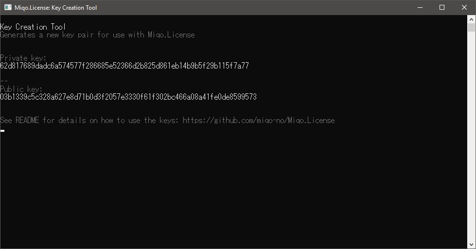

<h1 align="center">
  <br>
  
  <br>
  Miqo.License
  <br>
</h1>
<h3 align="center">
	:page_facing_up::closed_lock_with_key: The easy to use software licensing system for .NET
</h3>
<p align="center">

</p>

## [Overview](#overview)

Implement a licensing system that is easy to use into your application with Miqo.License. The library is cross platform and provides you with all the neccessary tools to issue, sign and verify the authenticity of a license.

The license files are saved in JSON format, and is signed using a state-of-the-art Elliptic Curve Digital Signature Algorithm (ECDSA) to ensure that the license files can't be tampered with after creation.

The library is available for .NET Standard 2.0 and .NET Framework 4.0 and higher. The tests project uses .NET Core 2.0.

### Features

The Miqo.License library makes it easy to:

* Easily and securely create, sign and validate your licenses.
* Support various license types/models including trial, standard, personal, etc.
* Enable/disable product features.
* You can add additional attributes to the license as needed.
* Save as a JSON file or to a JSON formatted string.

## [Installation](#installation)

The library is available as a signed NuGet package.

```
PM> Install-Package Miqo.License
```

## [Usage](#usage)

### Create a Private and Public Key for Your Product

Before you can sign a license file, you'll need a private and public key. Miqo.License uses an Elliptic Curve Digital Signature Algorithm (ECDSA) to ensure that the license files can't be tampered with after creation. The private key is used to sign the license file, and the public key is used to verify the authenticity of the license.

You can use the bundled [Key Creation Tool](#key-creation-tool) or create a new pair in code using ```Signer()``` like this:

```csharp
var signer = new Miqo.License.ECC.Signer();
var privateKey = signer.PrivateKey;
var publicKey = signer.PublicKey;
```

You can use ```Signer(privateKeyString)``` to provide a previously generated private key.

The private key should be stored securely and should be unique for each of your products. The public key is distributed with your software. If you want your customer to buy a new license on each major release you can create a key pair for each release and product.

### Create a New License

After generating the key pairs for your product you are ready to create a new license. The easiest way to do this is to use the FluentLicense class.

```csharp
var license = FluentLicense.CreateLicense()
	.WithUniqueIdentifier(Guid.NewGuid())
	.As(LicenseType.Standard)
	.ExpiresAt(DateTime.Today.AddYears(1))
	.ForProduct("Chewing Gum")
	.LicensedTo(new Customer {
				Name = @"Angus 'Mac' MacGyver",
				Email = "macgyver@phoenixfoundation.org",
				Company = "Phoenix Foundation"
			})
	.SignLicenseWithPrivateKey(privateKey);
```

The license is now signed and you are ready to save it as a JSON file:

```csharp
license.Save("ChewingGum.License");
```

If you would like to store the license file in a database or other fashion, you can use:

```csharp
var jsonString = license.ToJsonString();
```

### Loading a License

Load the license from a file:

```csharp
var license = License.Load("ChewingGum.License");
```

You can also load a license from a string:

```csharp
var license = License.LoadFromString(jsonString);
```

### Validate the License in Your Application

You can now start validating the license:

```csharp
using Miqo.License.Validation;

var validationFailures = license.Validate()
	.ProductName("Chewing Gum")
	.And()
	.ExpirationDate()
	.And()
	.Signature(publicKey)
	.AssertValidLicense();
```

Miqo.License will not throw any exceptions when a validation fails, but will rather return an enumeration of validation failures.

Simply check if there is any failure:

```csharp
if (validationFailures.Any()) {
	...
```

Or if you would like to iterate over each failure use:

```csharp
foreach (var failure in validationFailures) {
	Console.WriteLine($"{failure.GetType().Name}: {failure.Message} - {failure.HowToResolve}");
}
```

Use ```validationFailures.ToList();``` before attempting to use the result multiple times.

### Converting between ```byte[]``` and hex ```string```

Note that Miqo.License uses ```byte[]``` for the private and public keys. You can use the ```HexExtensions``` extension class to quickly convert between the ```byte[]``` and hex ```string```.

```csharp
byte[] publicKey = ECC.HexExtensions.ToHex(publicKeyHexString);
string hex = ECC.HexExtensions.HexToBytes(publicKey)
```

## [License File Format](#license-file-format)

This is an example of a license file created with Miqo.License:

```json
{
  "license": {
    "id": "39bca166-e7ad-471a-955c-873673a9115d",
    "createdAt": "2018-07-24T19:36:57.1917491Z",
    "product": "Chewing Gum",
    "licenseType": "Standard",
    "customer": {
      "name": "Angus 'Mac' MacGyver",
      "company": "Phoenix Foundation",
      "email": "macgyver@phoenixfoundation.org"
    },
    "expiresAt": "2019-07-24T00:00:00+02:00"
  },
  "signature": "ee9wYUeADZUlP7+Q+3PdrtBXqb4ricPlebTBbkMmYEdsPt/D3f6vVwlKQ4jrN1pGECaCTmljMOWWfDUNknLGdA=="
}
```

## [Key Creation Tool](#key-creation-tool)

You can use the bundled [Key Creation Tool](./Miqo.License.CreateKeys) to quickly generate a new key pair in hex string format.



## [Acknowledgements](#acknowledgements)

Miqo.License was inspired by [Portable.Licensing](https://github.com/dnauck/Portable.Licensing) (by Daniel Nauck, Nauck IT) and uses some of the validation code.

Two other libraries are also used for the ECDSA part.

* Signing is done using [Cryptography.ECDSA](https://github.com/Chainers/Cryptography.ECDSA) (by Chainers)
* Signature verification is done using [ChainEngine.Cryptography.EcDsa.Secp256k1](https://github.com/uchaindb/Cryptography.EcDsa.Secp256k1) (by UChainDb)

## [License](#license)

Miqo.License is made available under the [MIT License](LICENSE).
